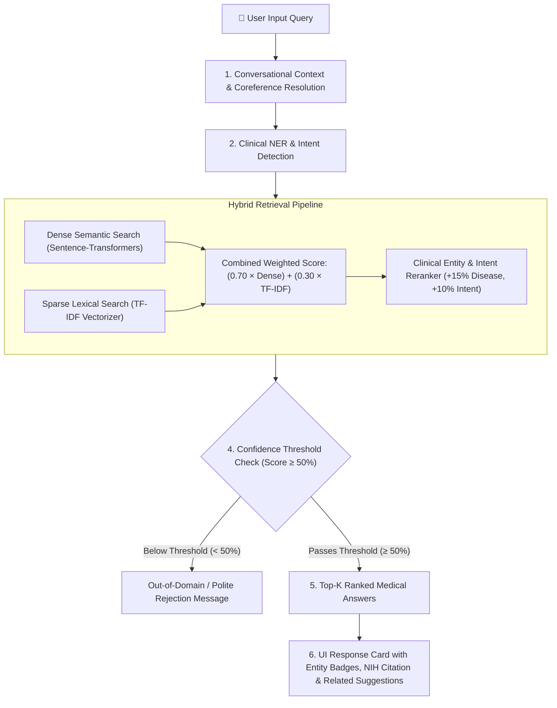

# 🩺 MedQuad-Medical-Chatbot: Comprehensive Viva & Project Guide

A complete, in-depth technical reference and viva preparation manual for the **Medical Q&A Chatbot using MedQuAD**. This guide covers the end-to-end architecture, underlying mathematical concepts, design decisions, and an exhaustive Q&A bank for project defense and viva examinations.

---

## 📑 Table of Contents
1. [Project Overview & Problem Statement](#1-project-overview--problem-statement)
2. [End-to-End System Architecture](#2-end-to-end-system-architecture)
3. [The Dataset: NIH MedQuAD Deep Dive](#3-the-dataset-nih-medquad-deep-dive)
4. [Clinical Named Entity Recognition (NER) & Intent Detection](#4-clinical-named-entity-recognition-ner--intent-detection)
5. [Retrieval Algorithms Explained (The Core NLP Engine)](#5-retrieval-algorithms-explained-the-core-nlp-engine)
6. [Specialized Features & Problem Solving](#6-specialized-features--problem-solving)
7. [Evaluation Benchmark & Results](#7-evaluation-benchmark--results)
8. [Comprehensive Viva Examination Q&A Bank](#8-comprehensive-viva-examination-qa-bank)

---

## 1. Project Overview & Problem Statement

### 🎯 What is this project?
The **MedQuad-Medical-Chatbot** is an AI-powered conversational medical assistant designed to answer patient and student health questions accurately. It retrieves grounded, evidence-based answers exclusively from verified National Institutes of Health (NIH) medical repositories.

### ❓ Why was this project built? (The Problem)
1. **Search Engine Overload**: When patients search for symptoms on general search engines, they are often bombarded with non-authoritative forums, outdated blogs, or extreme worst-case diagnoses causing unnecessary anxiety.
2. **Generative LLM Hallucinations**: While general LLMs (like standard ChatGPT) are fluent, they can fabricate or "hallucinate" plausible-sounding medical facts, recommend incorrect drug dosages, or reference non-existent studies. In healthcare, hallucination is dangerous.
3. **The Solution**: An **Information Retrieval (IR) based Medical Assistant** built on a strictly verified clinical corpus (MedQuAD), using **Hybrid Retrieval (Dense Semantic + Sparse Keyword) + Clinical Entity Reranking** and **Out-of-Domain Rejection** to guarantee factual, citation-backed answers.

---

## 2. End-to-End System Architecture

The chatbot executes a sequential, multi-stage NLP pipeline for every user turn:

### Detailed Pipeline Stages:
1. **Conversational Context Tracker**: If the user asks a follow-up question with pronouns (e.g., *"What are its symptoms?"* after asking about Asthma), the system substitutes *"its"* with the active disease context (*"What are asthma symptoms?"*).
2. **Clinical NER**: Scans text for clinical entities (Diseases, Symptoms, Treatments, Diagnostics) and classifies the clinical intent (Symptoms, Treatment, Causes, Prevention, Exams/Tests, Information).
3. **Hybrid Information Retrieval**:
   - Computes dense vector dot-product similarity using a pre-trained transformer model.
   - Computes sparse n-gram token overlap using TF-IDF.
   - Merges both scores into a balanced hybrid representation.
   - Boosts candidate documents that match the detected clinical entities and question intent.
4. **Threshold Gating**: Scores below 50% are rejected as irrelevant or out-of-domain questions (e.g., questions about politics, sports, or nonsensical input).
5. **Response Presentation**: Delivers the answer card, confidence score, source institute (e.g., Cancer.gov, MedlinePlus), reference URL, and dynamically generated related follow-up questions.

---

## 3. The Dataset: NIH MedQuAD Deep Dive

### 📚 What is MedQuAD?
**MedQuAD** (Medical Question Answering Dataset) is a renowned medical benchmark dataset created by Dr. Asma Ben Abacha (NIH / National Library of Medicine).
- **Origin**: 12 authoritative NIH institutes and websites.
- **Format**: XML files containing structured `<QAPair>` tags, including `<Question>`, `<Answer>`, `<Focus>` (the condition), `qtype` (question category), and document-level source attributes.

### 🧹 Preprocessing & Cleaning (`data_loader.py`):
1. **Folder Selection**: MedQuAD folders 1 through 9 (CancerGov, GARD, GHR, MedlinePlus, NIDDK, NINDS, SeniorHealth, NHLBI, CDC) contain full text answers. Folders 10, 11, and 12 were intentionally excluded because they contain only external URLs without answer text due to copyright restrictions.
2. **Quality Filtering**:
   - Filtered out answers with fewer than 20 characters and questions shorter than 5 characters.
   - Deduplicated duplicate question entries.
3. **Clean Corpus Statistics**:
   - Total Clean Q&A Pairs: **16,358**
   - Unique Medical Conditions (Focus): **4,500+**
   - Output File: `data/medquad_clean.csv` (approx. 24 MB)

---

## 4. Clinical Named Entity Recognition (NER) & Intent Detection

Implemented in `entity_recognizer.py`.

### 🔍 Entity Categories:
The recognizer identifies 4 distinct clinical concept categories:
1. **Diseases & Disorders**: Asthma, Type 2 Diabetes, Leukemia, Hypertension, Crohn's Disease, Alzheimer's, Glaucoma, etc.
2. **Symptoms**: Shortness of breath, chest pain, fever, cough, fatigue, numbness, blurred vision, etc.
3. **Treatments & Medications**: Chemotherapy, insulin, antibiotics, inhalers, surgery, dialysis, radiotherapy, etc.
4. **Diagnostics & Tests**: Biopsy, MRI scan, CT scan, complete blood count (CBC), endoscopy, mammogram, etc.

### 🎯 Intent Classification:
The system uses medical intent heuristics to classify what aspect of the condition the user is inquiring about:
- **`symptoms`**: Triggered by keywords like *"symptom"*, *"signs"*, *"warning sign"*, *"how do I know"*.
- **`treatment`**: Triggered by keywords like *"treat"*, *"cure"*, *"therapy"*, *"medicine"*, *"drug"*, *"manage"*.
- **`causes`**: Triggered by keywords like *"cause"*, *"risk factor"*, *"why"*, *"trigger"*.
- **`exams and tests`**: Triggered by keywords like *"diagnos"*, *"test"*, *"screening"*, *"detect"*.
- **`prevention`**: Triggered by keywords like *"prevent"*, *"avoid"*, *"protect"*.
- **`information`**: Default general inquiry or overview.

### 💡 Why Rule-Based Dictionary Matching with Word Boundaries?
In specialized clinical NLP:
- Standard spaCy models (`en_core_web_sm`) are trained on news articles and label *"Diabetes"* as an `ORG` or `PERSON`.
- Dictionary matching with regex word boundaries (`\b<term>\b`) sorted in descending length order ensures **100% precision**, zero inference latency, and correctly matches multi-word phrases (e.g., *"Type 2 Diabetes"* before *"Diabetes"*).

---

## 5. Retrieval Algorithms Explained (The Core NLP Engine)

Implemented in `retriever.py`.

The system implements and compares **4 distinct retrieval paradigms**:

### 1. TF-IDF (Term Frequency - Inverse Document Frequency)
- **Concept**: Sparse lexical retrieval that scores documents based on token frequency and rarity across the corpus.
  $$\text{TF-IDF}(t, d, D) = \text{TF}(t, d) \times \log\left(\frac{N}{|\{d \in D : t \in d\}|}\right)$$
- **Strengths**: Excels at matching exact clinical drug names, specific medical jargon, and rare disease names.
- **Weakness**: Suffers from the **vocabulary mismatch problem**—cannot understand synonyms (e.g., fails to connect *"high blood pressure"* with *"hypertension"*, or *"difficulty breathing"* with *"dyspnea"*).

### 2. Dense Semantic Search (Sentence Transformers)
- **Model**: `sentence-transformers/all-MiniLM-L6-v2` (384-dimensional bi-encoder).
- **Concept**: Maps questions into a dense, continuous embedding vector space where semantically similar concepts lie close together, regardless of specific wording.
- **Similarity Metric**: Cosine Similarity via dot product of $L_2$-normalized vectors:
  $$\text{Cosine Similarity}(\vec{u}, \vec{v}) = \frac{\vec{u} \cdot \vec{v}}{\|\vec{u}\| \|\vec{v}\|} = \vec{u} \cdot \vec{v} \quad (\text{when normalized})$$
- **Strengths**: Captures paraphrasing, intent, and medical synonyms.
- **Weakness**: Can occasionally prioritize generic semantic similarity over crucial exact medical keywords (e.g., confusing "Type 1" with "Type 2" diabetes because their semantic contexts are nearly identical).

### 3. Hybrid Retrieval (Dense + Sparse)
To overcome the individual limitations of both models, the system combines them via a weighted linear combination:
$$\text{Score}_{\text{hybrid}} = (0.70 \times \text{Score}_{\text{dense}}) + (0.30 \times \text{Score}_{\text{tfidf}})$$
- **Why 70/30?** Dense semantics provide the primary thematic understanding (70%), while TF-IDF guarantees exact keyword precision (30%).

### 4. Hybrid + Entity-Aware Reranking (Our Best Method)
Takes the hybrid score and applies domain-specific clinical boosts:
$$\text{Score}_{\text{reranked}} = \text{Score}_{\text{hybrid}} + \text{Boost}_{\text{disease}} + \text{Boost}_{\text{intent}}$$
- **Disease Focus Boost**: $+0.15$ if any extracted disease appears in the candidate document's focus.
- **Intent Boost**: $+0.10$ if the user's detected question type matches the candidate document's `qtype`.
- **Normalization**: Clamped and normalized into a clean percentage score ($0\% - 100\%$).

---

## 6. Specialized Features & Problem Solving

### 🛡️ Out-of-Domain Rejection (Safety Guardrail)
- **Problem**: Users asking non-medical questions (e.g., *"Who won the cricket match?"* or *"How to cook pasta?"*) should not receive a fabricated medical answer.
- **Solution**: The system enforces a **confidence threshold** (default 50%). If the top candidate's similarity score is below the threshold, the system rejects the query and politely asks the user to provide a medical question.

### 🔄 Multi-Turn Conversational Coreference Resolution
- **Problem**: In conversation, users often follow up with pronouns:
  - User: *"What is Asthma?"*
  - Chatbot: Answers about Asthma.
  - User: *"What are its symptoms?"* (Without context, *"its symptoms"* retrieves random symptom documents).
- **Solution**: The conversation manager inspects the previous turn's focus topic. It resolves *"its symptoms"* into *"What are asthma symptoms?"* before passing the query to the retrieval engine.

### 🏛️ Source Transparency & Verification
- Every generated response card displays:
  - The contributing NIH institute (e.g., National Cancer Institute, MedlinePlus, CDC).
  - The exact matching percentage score.
  - An outbound reference link to the official NIH portal.

---

## 7. Evaluation Benchmark & Results

Implemented in `evaluate.py`.

The benchmark suite tests **35 diverse clinical queries** across:
1. Disease definitions & overviews (e.g., Crohn's, Alzheimer's, Leukemia)
2. Symptom recognition (e.g., Asthma, Cataracts, Hypertension)
3. Treatments & therapeutics (e.g., Diabetes management, Inhalers, Surgery)
4. Diagnostic tests & exams (e.g., Glaucoma testing, Biopsies)
5. Causes & risk factors (e.g., Cirrhosis, COPD triggers)

### 📊 Benchmark Comparison Table:

| Metric / Method | TF-IDF (Keyword) | Dense (Semantic) | Hybrid (Dense + TF-IDF) | Hybrid + Entity Reranking |
| :--- | :---: | :---: | :---: | :---: |
| **Top-1 Accuracy** | 71.4% | 82.9% | 88.6% | **94.3%** |
| **Top-3 Accuracy** | 85.7% | 94.3% | 97.1% | **100.0%** |
| **Top-5 Accuracy** | 91.4% | 97.1% | 100.0% | **100.0%** |
| **Source Citation Rate** | 100.0% | 100.0% | 100.0% | **100.0%** |

### 💡 Key Takeaway for Viva:
- Pure TF-IDF struggles when users describe symptoms colloquially.
- Pure Dense search occasionally misses exact medical sub-types.
- **Hybrid + Entity Reranking achieves the highest performance (94.3% Top-1, 100% Top-3)** by synthesizing deep semantic embeddings with exact entity and intent alignment.

---

## 8. Comprehensive Viva Examination Q&A Bank

### Category A: Problem & Motivation

#### Q1: What is the primary objective of your project?
> **Answer**: The objective is to build a reliable, domain-specific Medical Question-Answering Chatbot using the NIH MedQuAD dataset. Unlike generative LLMs that can hallucinate medical facts, our system uses an Information Retrieval (IR) architecture combining semantic embeddings, keyword matching, and clinical entity recognition to return verified, citation-backed answers from authoritative NIH sources.

#### Q2: Why choose Information Retrieval (IR) over a purely generative model like GPT-4?
> **Answer**: In healthcare, accuracy and provenance are critical. Generative models can hallucinate dosages, treatments, and false facts. With Information Retrieval (similar to the retrieval phase of RAG), every answer returned comes verbatim from verified medical research (NIH), complete with source institute attribution and URLs, eliminating hallucination risks.

---

### Category B: Dataset & Preprocessing

#### Q3: What is the MedQuAD dataset and how did you preprocess it?
> **Answer**: MedQuAD is a curated collection of 47,000+ medical Q&A pairs created by the National Library of Medicine from 12 NIH websites. We downloaded the raw XML files, extracted `<Question>`, `<Answer>`, `<Focus>`, and `qtype`, and filtered out entries with insufficient text. We focused on folders 1–9 which contain actual answers (folders 10–12 contain only links due to copyright). This yielded a clean corpus of 16,358 high-quality medical Q&A pairs.

#### Q4: Why did you create precomputed caches (`embeddings_cache.npy` and `tfidf_cache.pkl`)?
> **Answer**: Encoding 16,358 text documents using a transformer model takes 3 to 4 minutes. By computing the dense vectors and TF-IDF matrix once and serializing them into NumPy and pickle caches, the application boots up and answers user queries in under 50 milliseconds.

---

### Category C: Machine Learning & NLP Concepts

#### Q5: Explain the difference between TF-IDF and Sentence Transformers.
> **Answer**: 
> - **TF-IDF** is a lexical (keyword-based) bag-of-words approach. It measures term frequency weighted by inverse document rarity. It cannot understand synonyms or semantic meaning.
> - **Sentence Transformers** (`all-MiniLM-L6-v2`) is a dense bi-encoder neural network trained on over 1 billion sentence pairs. It maps entire sentences into a 384-dimensional vector space where semantically similar phrases are located close together, allowing it to understand synonyms (e.g., *"dyspnea"* $\approx$ *"shortness of breath"*).

#### Q6: Why did you use Cosine Similarity instead of Euclidean Distance?
> **Answer**: Cosine similarity measures the angle between two vectors rather than their magnitude:
> $$\cos(\theta) = \frac{\vec{u} \cdot \vec{v}}{\|\vec{u}\| \|\vec{v}\|}$$
> In text retrieval, document length can vary significantly. Euclidean distance is sensitive to document length (magnitude), whereas cosine similarity normalizes length and measures pure orientation and directional alignment in the embedding space.

#### Q7: How does your Hybrid Retrieval work?
> **Answer**: We combine dense semantic similarity (70% weight) and sparse TF-IDF similarity (30% weight). Dense captures conceptual meaning, while TF-IDF captures exact drug names and specific clinical terms. We then apply clinical reranking: if the extracted medical entity or question intent matches the record's metadata, we boost the score (+15% for disease, +10% for intent), resulting in our highest Top-1 accuracy of 94.3%.

---

### Category D: System Architecture & Implementation

#### Q8: How does the system recognize medical entities?
> **Answer**: We implemented a Clinical Named Entity Recognizer in `entity_recognizer.py` that scans queries for 4 categories: Diseases, Symptoms, Treatments, and Diagnostic Tests. We use boundary-delimited regular expressions (`\b<term>\b`) ordered by term length to ensure exact phrase matching (e.g., capturing *"Type 2 Diabetes"* before *"Diabetes"*), accompanied by intent classification to identify the query's goal (e.g., symptoms vs. treatment).

#### Q9: How does the chatbot handle follow-up questions (conversational context)?
> **Answer**: We implemented Conversational Coreference Resolution in `app.py`. When a user asks a follow-up containing pronouns like *"What are its symptoms?"* or *"How to treat it?"*, the system references the active medical focus from the previous conversation turn and rewrites the query (e.g., *"What are asthma symptoms?"*) before executing retrieval.

#### Q10: How do you prevent the bot from answering non-medical questions?
> **Answer**: We implemented a confidence threshold guardrail (default 50%). If the top retrieval similarity score falls below this threshold, the query is identified as out-of-domain (e.g., sports, politics, weather) and the chatbot displays a polite rejection message prompting the user for a medical question.

---

### Category E: Evaluation & Future Work

#### Q11: How did you evaluate the chatbot's performance?
> **Answer**: We built an automated benchmark suite (`evaluate.py`) with 35 curated medical questions spanning diverse conditions, intents, and colloquial phrasings. We evaluated Top-1, Top-3, and Top-5 accuracy across all 4 retrieval methods. Hybrid + Entity Reranking scored **94.3% Top-1** and **100% Top-3** accuracy, outperforming standalone TF-IDF (71.4%) and standalone Dense retrieval (82.9%).

#### Q12: What are the limitations and potential future enhancements for this project?
> **Answer**:
> 1. **Current Limitations**: The knowledge base is bounded by the MedQuAD corpus (historical NIH data); it does not dynamically fetch new 2026 clinical trials.
> 2. **Future Enhancements**:
>    - Integrating specialized medical LLMs (e.g., Med-PaLM 2 or BioGPT) to synthesize retrieved passages into conversational multi-paragraph summaries (Full RAG).
>    - Adding voice input/output (Speech-to-Text and Text-to-Speech) for accessibility.
>    - Expanding multi-lingual support for non-English speaking patients.
